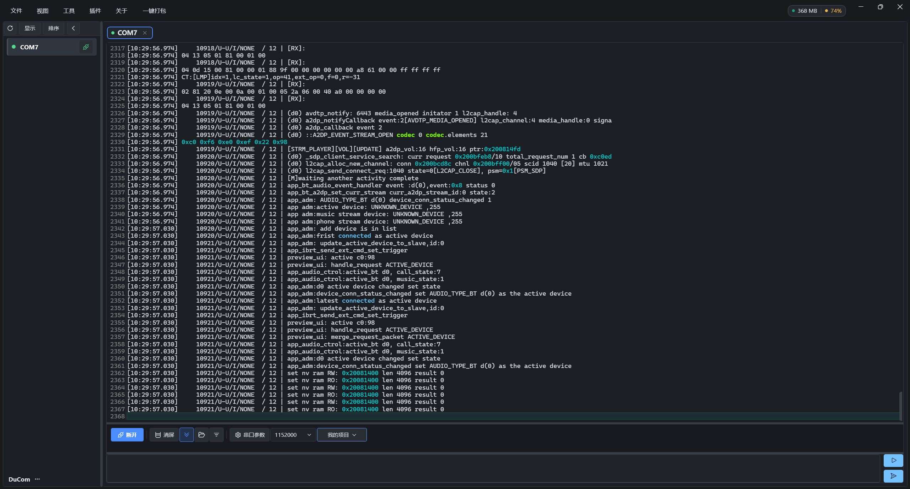
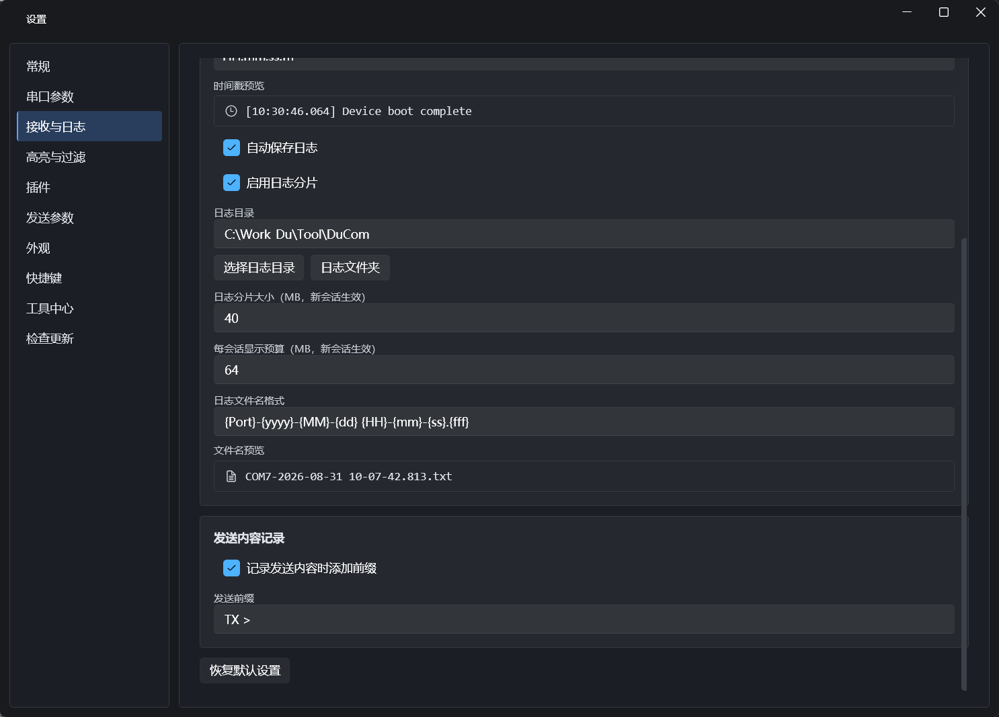
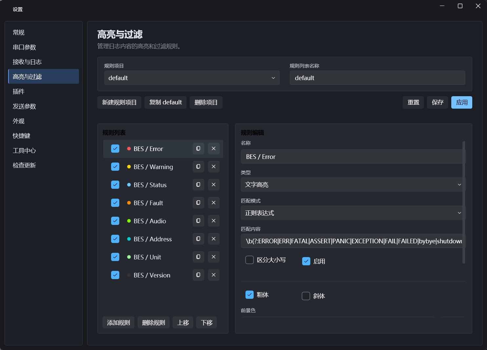
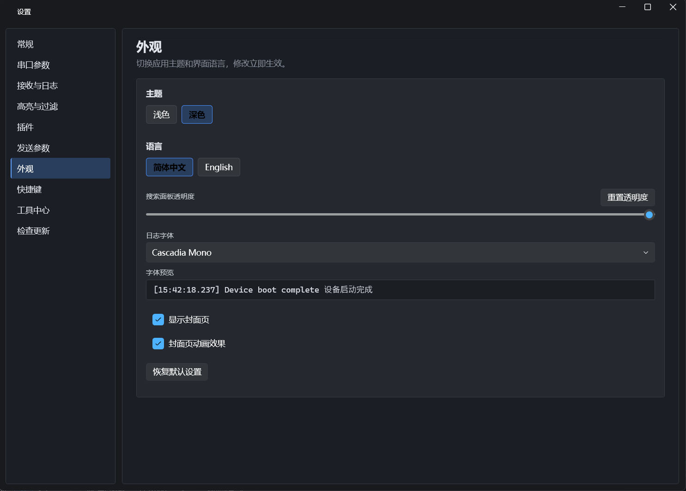
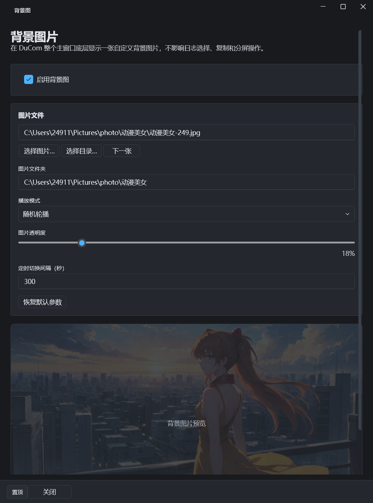
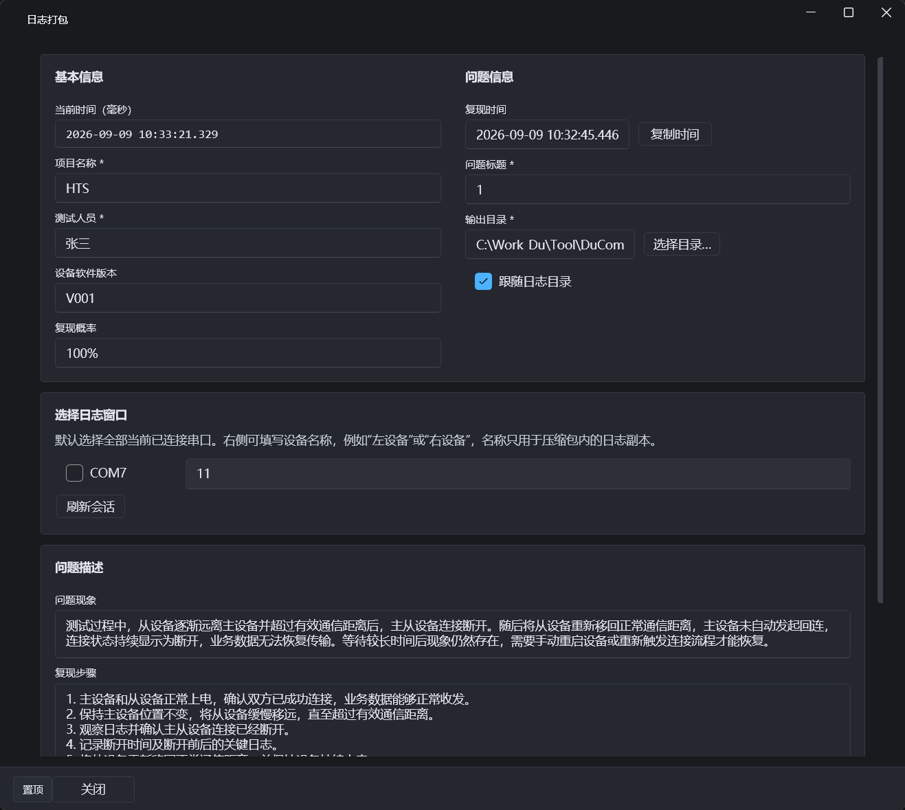
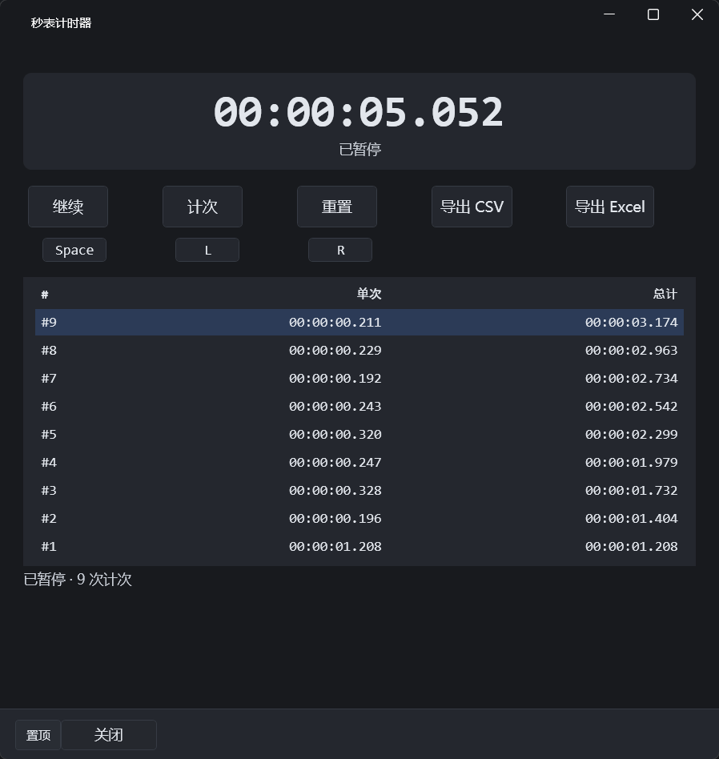
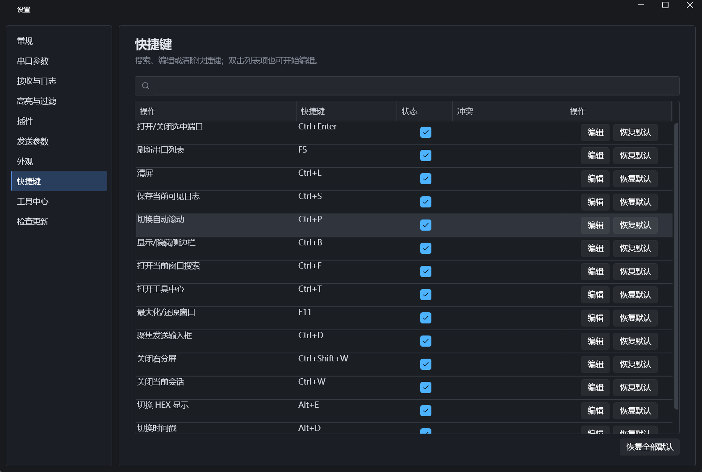
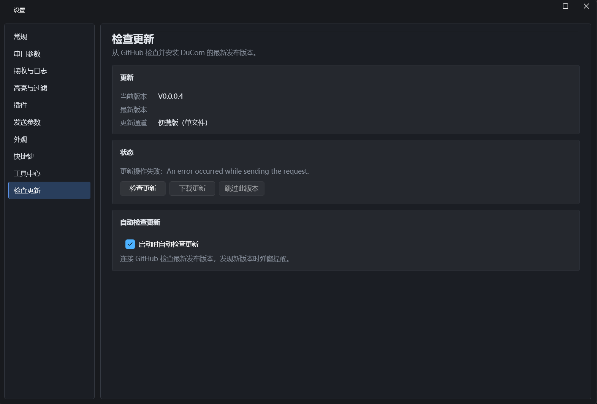

# DuCom

给嵌入式开发者用的串口工具。Windows 平台，开源。

做这个工具的初衷：创建一个高性能、多功能的串口工具。

## 下载与文档

- [下载最新 Release](https://github.com/adu9527/DuCom/releases) — 提供约 78 MB 的自包含单文件 EXE（不同版本可能略有浮动），下载后直接双击，无需安装 .NET 运行环境
- [用户手册（中文）](Doc/UserManual.zh-CN.md) · [User Manual (English)](Doc/UserManual.en-US.md)
- [开发者文档（中文）](Doc/DeveloperGuide.zh-CN.md) · [Developer Guide (English)](Doc/DeveloperGuide.en-US.md)
- [插件协议 DPP/1（中文）](Doc/PluginProtocol.DPP1.zh-CN.md) · [Plugin Protocol DPP/1 (English)](Doc/PluginProtocol.DPP1.en-US.md)
- [网页版文档入口](Doc/Web/index.html)
- 反馈交流：QQ 群 `1107820408` · [GitHub Issues](https://github.com/adu9527/DuCom/issues)

### 启动封面

启动后先看到封面页，带动态效果。可在设置中关闭或调整。

<p align="center">
  
</p>

### 主界面

左边选串口，右边是工作区。默认深色主题。实际使用时可以同时开多个串口，每个独立一个标签页或者分屏显示。高波特率下数据刷得飞快但界面不会卡死：

<p align="center">
  
</p>

日志支持自动高亮，关键信息（比如 ERROR、WARNING）一目了然。

### 接收与日志

接收到的数据可以自动落盘，支持按时间或文件大小自动分片。时间戳格式、存储路径、分片大小、文件名格式都能自定义。改完配置重启串口会话即可生效。

<p align="center">
  
</p>

### 高亮与过滤

不同颜色的日志代表不同严重级别。DuCom 的高亮系统用的是正则匹配，灵活度比较高：

<p align="center">
  
</p>

内置了几套 BES 芯片常用的规则模板（Error / Warning / Status / Fault 等），也可以自己加。规则支持导入导出，多台电脑之间同步配置很方便。

### 外观与个性化

支持浅色/深色主题切换、简体中文/English 语言切换、日志字体自定义、搜索面板透明度调节，以及启动封面动画开关。

<p align="center">
  
</p>

### 背景图片

支持在主窗口底层显示自定义背景图片，不影响日志选择、复制和分屏操作。可设置图片文件夹随机轮播、透明度、切换间隔。

<p align="center">
  
</p>

### 日志打包

遇到问题时，一键打包指定串口的日志，自动填写时间、项目、问题描述等信息，生成结构化的压缩包方便反馈和追溯。

<p align="center">
  
</p>

### 秒表计时器

内置高精度秒表，支持计次、暂停、继续，可导出 CSV / Excel，方便做时序测试和性能统计。

<p align="center">
  
</p>

### 快捷键

几乎所有常用操作都支持快捷键，并且可以按自己的习惯自定义。支持搜索、编辑、冲突检测、一键恢复默认。

<p align="center">
  
</p>

### 检查更新

内置从 GitHub 检查最新版本的能力，支持自动检查和手动更新，提供便携版（单文件）和安装版两种更新通道。

<p align="center">
  
</p>

## 能做什么

- **多串口同时工作** — 标签页或分屏，每个串口独立配置、独立收发
- **STR / HEX 模式** — 十六进制查看、时间戳、ANSI/VT 转义序列渲染
- **高速不丢数据** — 串口接收、日志写入、UI 渲染三条线解耦，高波特率长时间运行稳定
- **搜索与过滤** — 关键词高亮、正则过滤，从海量日志里快速定位问题
- **发送辅助** — 发送历史记录、命令组管理、定时发送、自动追加换行、转义字符解析
- **日志自动落盘** — 异步写入、自动分片、可配置滚动策略、自定义文件名格式
- **迷你日志窗口** — 浮动小窗显示最新几行，调试时放在旁边很方便
- **虚拟串口 & 网络工具** — 虚拟串口对（com0com 集成）、Telnet/串口桥接
- **WatchDog 规则** — 监控特定关键字并触发告警或自动动作
- **数据导入** — 可以只读打开其他串口工具导出的日志文件
- **背景图片** — 主窗口自定义背景，轮播、透明度可调
- **秒表计时器** — 高精度计时、计次、导出 CSV/Excel
- **日志打包** — 结构化问题日志导出，方便反馈追溯
- **自动更新** — GitHub Release 自动检查与下载
- **插件扩展** — 基于 DPP/1 协议的插件系统，支持菜单、设置面板、工具页、背景图等扩展点

## 环境要求

- Windows 10+
- .NET 10 SDK（如果要从源码编译）
- 推荐用 Visual Studio 开发，WPF 的 XAML 编辑和调试体验更好

## 编译运行

```powershell
cd DuCom
dotnet build
dotnet run --project src\DuCom
```

跑测试：

```powershell
cd DuCom
dotnet test
```

## 打包发布

Visual Studio 里右键 `DuCom` 项目 → 发布。推荐设置：

| 配置项   | 建议值            |
| ----- | -------------- |
| 配置    | Release        |
| 目标运行时 | win-x64        |
| 部署模式  | Self-contained |
| 单文件输出 | 启用             |

发布产物作为 GitHub Release 上传，不要直接提交到仓库。

## 项目结构

```text
DuCom/
  src/DuCom/                      WPF 主程序，界面、ViewModel、依赖注入
  src/DuCom.Core/                 核心逻辑层，无 UI 依赖（串口、管线、日志、存储）
  src/DuCom.Plugin.Sdk/           插件协议 SDK（DPP/1），供插件开发者使用
  src/DuCom.PluginHost/           插件宿主运行时（生命周期、IPC 代理、资源管控）
  src/DuCom.Plugins.BackgroundImage/  内置插件：背景图片
  src/DuCom.Plugins.LogPackage/       内置插件：日志打包
  src/DuCom.Plugins.Timer/            内置插件：秒表计时器
  tests/DuCom.Core.Tests/         xUnit 单元测试
  tools/DuCom.LoadGenerator/      压测工具，模拟高速串口输出
  benchmarks/                     BenchmarkDotNet 性能基准测试
  docs/                           架构设计文档、决策记录
```

## 分支与协作

| 分支   | 用途              | 谁来推                 |
| ---- | --------------- | ------------------- |
| main | 稳定版本，Release 发布 | 作者（仅限作者推送）          |
| test | 日常开发、功能迭代       | 作者（外部贡献者请提 PR 到此分支） |

个人开发者请 fork 后提 **PR 到 `test` 分支**，由作者审核合并。`main` 分支仅限作者推送并负责打 Release。

## 一些设计上的取舍

1. **串口回调只负责往队列里塞数据**，不做任何解析和显示——这是不卡的根基
2. **日志写盘和 UI 渲染完全分开**，互相不阻塞
3. **UI 按固定节奏刷新**，不是来一条数据显示一条，否则高波特率下 UI 线程会被淹死
4. **内存有预算上限**，超长的行会自动分段，不会因为某条异常日志把内存撑爆
5. **串口的打开/关闭操作严格串行化**，防止竞态条件导致端口状态错乱
6. **插件与核心严格隔离**，每个插件独立进程，故障不影响串口主流程

Core 层和 Plugin.Sdk 完全不依赖 WPF，方便以后如果有需要可以复用到其他平台（比如做个命令行版本）。

## 许可证

[GPL-3.0](https://www.gnu.org/licenses/gpl-3.0.html)

## 参与

欢迎提 Issue 和 PR。几个小要求：

- Core 层和 Plugin.Sdk 保持零 UI 依赖
- 改了逻辑代码记得补测试
